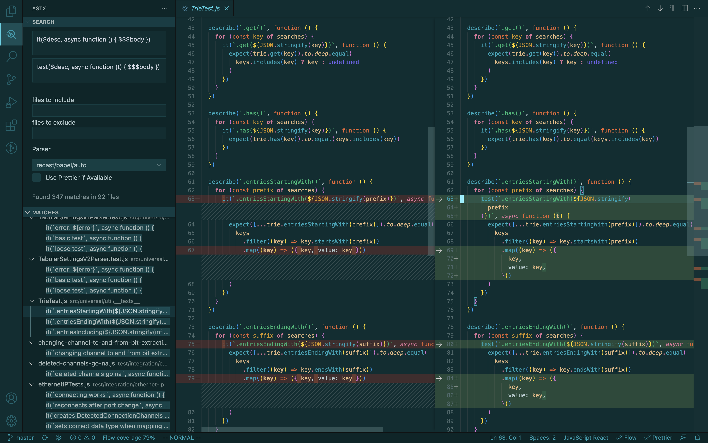

# astx

[](https://circleci.com/gh/codemodsquad/astx)
[](https://codecov.io/gh/codemodsquad/astx)
[](https://github.com/semantic-release/semantic-release)
[](http://commitizen.github.io/cz-cli/)
[](https://badge.fury.io/js/astx)

Super powerful structural search and replace for JavaScript and TypeScript to automate your refactoring

# Table of Contents

<!-- toc -->

- [astx](#astx)
- [Table of Contents](#table-of-contents)
- [Introduction](#introduction)
- [Usage examples](#usage-examples)
  - [Fixing eslint errors](#fixing-eslint-errors)
  - [Converting require statements to imports](#converting-require-statements-to-imports)
  - [Making code DRY](#making-code-dry)
- [Roadmap](#roadmap)
- [VSCode Extension](#vscode-extension)
- [Prior art and philosophy](#prior-art-and-philosophy)
- [Pattern Language](#pattern-language)
  - [Placeholders](#placeholders)
    - [Node Placeholders (`$<name>`)](#node-placeholders-name)
    - [Array Placeholders (`$$<name>`)](#array-placeholders-name)
    - [Rest Placeholders (`$$$<name>`)](#rest-placeholders-name)
    - [Anonymous Placeholders](#anonymous-placeholders)
    - [Backreferences](#backreferences)
  - [Object Matching](#object-matching)
  - [List Matching](#list-matching)
    - [Ordered and unordered List Matching](#ordered-and-unordered-list-matching)
    - [Support Table](#support-table)
  - [String Matching](#string-matching)
  - [Extracting nodes](#extracting-nodes)
  - [Special Constructs](#special-constructs)
    - [`$Maybe(pattern)`](#maybepattern)
    - [`$Or(...)`](#or)
    - [`$And(...)`](#and)
    - [`$Maybe<pattern>`](#maybepattern-1)
    - [`$Or<...>`](#or-1)
    - [`$And<...>`](#and-1)
    - [`$Ordered`](#ordered)
    - [`$Unordered`](#unordered)
- [API](#api)
  - [interface NodePath](#interface-nodepath)
  - [class Astx](#class-astx)
    - [`constructor(backend: Backend, paths: NodePath<any>[] | Match[], options?: { withCaptures?: Match[] })`](#constructorbackend-backend-paths-nodepathany--match-options--withcaptures-match-)
    - [`.find(...)` (`Astx`)](#find-astx)
    - [`.closest(...)` (`Astx`)](#closest-astx)
    - [`FindOptions`](#findoptions)
      - [`FindOptions.where` (`{ [captureName: string]: (path: Astx) => boolean }`)](#findoptionswhere--capturename-string-path-astx--boolean-)
    - [`.find(...).replace(...)` (`void`)](#findreplace-void)
    - [`.size()` (`number`)](#size-number)
    - [``[name: `$${string}` | `$$${string}` | `$$$${string}`]`` (`Astx`)](#name-string--string--string-astx)
    - [`.placeholder` (`string | undefined`)](#placeholder-string--undefined)
    - [`.node` (`Node`)](#node-node)
    - [`.path` (`NodePath`)](#path-nodepath)
    - [`.code` (`string`)](#code-string)
    - [`.stringValue` (`string`)](#stringvalue-string)
    - [`[Symbol.iterator]` (`Iterator<Astx>`)](#symboliterator-iteratorastx)
    - [`.matches` (`Match[]`)](#matches-match)
    - [`.match` (`Match`)](#match-match)
    - [`.paths` (`NodePath[]`)](#paths-nodepath)
    - [`.nodes` (`Node[]`)](#nodes-node)
    - [`.filter(iteratee)` (`Astx`)](#filteriteratee-astx)
    - [`.map<T>(iteratee)` (`T[]`)](#maptiteratee-t)
    - [`.at(index)` (`Astx`)](#atindex-astx)
    - [`.withCaptures(...captures)` (`Astx`)](#withcapturescaptures-astx)
  - [Match](#match)
    - [`.type`](#type)
    - [`.path`](#path)
    - [`.node`](#node)
    - [`.paths`](#paths)
    - [`.nodes`](#nodes)
    - [`.captures`](#captures)
    - [`.pathCaptures`](#pathcaptures)
    - [`.arrayCaptures`](#arraycaptures)
    - [`.arrayPathCaptures`](#arraypathcaptures)
    - [`.stringCaptures`](#stringcaptures)
- [Transform files](#transform-files)
  - [`exports.find` (optional)](#exportsfind-optional)
  - [`exports.where` (optional)](#exportswhere-optional)
  - [`exports.replace` (optional)](#exportsreplace-optional)
  - [`exports.astx` (optional)](#exportsastx-optional)
  - [`exports.onReport` (optional)](#exportsonreport-optional)
  - [`exports.finish` (optional)](#exportsfinish-optional)
- [Configuration](#configuration)
    - [Config option: `parser`](#config-option-parser)
    - [Config option: `parserOptions`](#config-option-parseroptions)
    - [Config option: `prettier`](#config-option-prettier)
- [CLI](#cli)

<!-- tocstop -->

# Introduction

If you've ever refactored a function, and had to go through and change all the calls to that function by hand one by one, you know
how much time it can take. For example, let's say you decided to move an optional boolean `force` argument to your `rmdir` function
into an options hash argument:

```js
// before:
rmdir('old/stuff')
rmdir('new/stuff', true)

// after:
rmdir('old/stuff')
rmdir('new/stuff', { force: true })
```

Changing a bunch of calls to `rmdir` by hand would suck. You could try using regex replace, but it's fiddly and wouldn't tolerate whitespace and
linebreaks well unless you work really hard at the regex.

Now there's a better option...you can refactor with confidence using `astx`!

```sh
astx -f 'rmdir($path, $force)' -r 'rmdir($path, { force: $force })' src
```

What's going on here? Find and replace must be valid JS expressions or statements. `astx` parses them
into AST (Abstract Syntax Tree) nodes, and then looks for matching AST nodes in your code.
`astx` treats any identifier in starting with `$` in the find or replace expression as a placeholder - in this case, `$path` and `$force`.
(You can use leading `$_` as an escape, for instance `$_foo` will match literal identifier `$foo` in your code).

When it gets to a function call, it checks that the function name matches `rmdir`, and that it has the same number of arguments.
Then it checks if the arguments match.
Our patterns for both arguments (`$path`, `$force`) are placeholders, so they automatically match and capture the corresponding AST nodes
of the two arguments in your code.

Then `astx` replaces that function call it found with the replacement expression. When it finds placeholders in the replacement expression,
it substitutes the corresponding values that were captured for those placeholders (`$path` captured `'new/stuff'` and `$force` captured `true`).

# Usage examples

## Fixing eslint errors

Got a lot of `Do not access Object.prototype method 'hasOwnProperty' from target object` errors?

```js
// astx.js
exports.find = `$a.hasOwnProperty($b)`
exports.replace = `Object.prototype.hasOwnProperty.call($a, $b)`
```

## Converting require statements to imports

```js
// astx.js
exports.find = `const $id = require('$source')`
exports.replace = `import $id from '$source'`
```

## Making code DRY

In `jscodeshift-add-imports` I had a bunch of test cases following this pattern:

```js
it(`leaves existing default imports untouched`, function () {
  const code = `import Baz from 'baz'`
  const root = j(code)
  const result = addImports(root, statement`import Foo from 'baz'`)
  expect(result).to.deep.equal({ Foo: 'Baz' })
  expect(root.toSource()).to.equal(code)
})
```

I wanted to make them more DRY, like this:

```js
it(`leaves existing default imports untouched`, function () {
  testCase({
    code: `import Baz from 'baz'`,
    add: `import Foo from 'baz'`,
    expectedCode: `import Baz from 'baz'`,
    expectedReturn: { Foo: 'Baz' },
  })
})
```

Here was a transform for the above. (Of course, I had to run a few variations of this for
cases where the expected code was different, etc.)

```js
exports.find = `
const code = $code
const root = j(code)
const result = addImports(root, statement\`$add\`)
expect(result).to.deep.equal($expectedReturn)
expect(root.toSource()).to.equal(code)
`

exports.replace = `
testCase({
  code: $code,
  add: \`$add\`,
  expectedCode: $code,
  expectedReturn: $expectedReturn,
})
`
```

# Roadmap

I just finally got version 2 released as of December 2022 after tons of hard work 🎉
Right now I'm working on the [VSCode Extension](https://github.com/codemodsquad/vscode-astx).
After that I want to make a documentation website that better illustrates how to use `astx`.

# VSCode Extension

The [VSCode Extension](https://github.com/codemodsquad/vscode-astx) is currently in beta, but try it out!



# Prior art and philosophy

While I was thinking about making this I discovered [grasp](https://www.graspjs.com/), a similar tool that inspired the `$` capture syntax.
There are several reasons I decided to make `astx` anyway:

- Grasp uses the Acorn parser, which doesn't support TypeScript or Flow code AFAIK
- Hasn't been updated in 4 years
- Grasp's replace pattern syntax is clunkier, doesn't match the find pattern syntax:
  `grasp -e 'setValue($k, $v, true)' -R 'setValueSilently({{k}}, {{v}})' file.js`
- It has its own DSL (SQuery) that's pretty limited and has a slight learning curve
- I wanted a `jscodeshift`-like API I could use in JS for advanced use cases that are probably awkward/impossible in Grasp

So the philosophy of `astx` is:

- **Provide a simple find and replace pattern syntax that's ideal for simple cases and has minimum learning curve**
- **Use the same search and replace pattern syntax in the javascript API for anything more complex, so that you have unlimited flexibility**

Paste your code into [AST Explorer](https://astexplorer.net/) if you need to learn about the structure of the AST.

# Pattern Language

Astx find patterns are just JavaScript or TypeScript code that may contain _placeholder_ wildcards or other special constructs
like `$Or(A, B)`. Generally speaking, parts of the pattern that aren't wildcards or special constructs have to match exactly.

For example, the find pattern `foo($a)` matches any call to the function `foo` with a single argument. The argument can anything
and is _captured_ as `$a`.

Replace patterns are almost identical to find patterns, except that placeholders get replaced with whatever was _captured_ into
the placeholder name by the find pattern, and special find constructs like `$Or(A, B)` have no special meaning in replace patterns.
(In the future, there may be special replace constructs that perform some kind of transformation on captured nodes.)

For example, the find pattern `foo($a)` matches `foo(1 + 2)`, then the replace pattern `foo({ value: $a })` will generate the code
`foo({ value: 1 + 2 })`.

## Placeholders

Generally speaking, an identifier starting with `$` is a _placeholder_ that functions like a wildcard. There are three types of placeholders:

- `$<name>` matches any single node ("node placeholder")
- `$$<name>` matches a contiguous list of nodes ("array placeholder")
- `$$$<name>`: matches all other siblings ("rest placeholder")

The `<name>` (if given) must start with a letter or number; otherwise the identifier will
not be treated as a placeholder.

Rest placeholders (`$$$`) may not be sibilings of ordered list placeholders (`$$`).

Unless a placeholder is anonymous, it will "capture" the matched node(s), meaning you can use the same placeholder in the
replacement pattern to interpolate the matched node(s) into the generated replacement. In the Node API you can also access
the captured AST paths/nodes via the placeholder name.

### Node Placeholders (`$<name>`)

These placeholders match a single node. For example, the pattern `[$a, $b]` matches an array expression with two elements,
and those elements are captured as `$a` and `$b`.

### Array Placeholders (`$$<name>`)

These placeholders match a contiguous list of nodes. For example, the pattern `[1, $$a, 2, $$b]` matches an array expression
with `1` as the first element, and `2` as a succeeding element. Any elements between `1` and the first `2` is captured as `$$a`,
and elements after the first `2` are captured as `$$b`.

### Rest Placeholders (`$$$<name>`)

These placeholders match the rest of the siblings that weren't matched by something else. For example, the pattern `[1, $$$a, 2]`
matches an array expression that has elements `1` and `2` at any index. Any other elements (including additional occurrences of `1`
and `2`) are captured as `$$$a`.

### Anonymous Placeholders

You can use a placeholder without a name to match node(s) without capturing them. `$` will match any single node, `$$` will match a
contiguous list of nodes, and `$$$` will match all other siblings.

### Backreferences

If you use the same capture placeholder more than once, subsequent positions will have to match what was captured for the first occurrence of the placeholder.

For example, the pattern `foo($a, $a, $b, $b)` will match only `foo(1, 1, {foo: 1}, {foo: 1})` in the following:

```js
foo(1, 1, { foo: 1 }, { foo: 1 }) // match
foo(1, 2, { foo: 1 }, { foo: 1 }) // no match
foo(1, 1, { foo: 1 }, { bar: 1 }) // no match
```

**Note**: array capture placeholders (`$$a`) and rest capture placeholders (`$$$a`) don't currently support backreferencing.

## Object Matching

An `ObjectExpression` (aka object literal) pattern will match any `ObjectExpression` in your code with the same properties in any order.
It will not match if there are missing or additional properties. For example, `{ foo: 1, bar: $bar }` will match `{ foo: 1, bar: 2 }` or `{ bar: 'hello', foo: 1 }`
but not `{ foo: 1 }` or `{ foo: 1, bar: 2, baz: 3 }`.

You can match additional properties by using `...$$captureName`, for example `{ foo: 1, ...$$rest }` will match `{ foo: 1 }`, `{ foo: 1, bar: 2 }`, `{ foo: 1, bar: 2, ...props }` etc.
The additional properties will be captured in `match.arrayCaptures`/`match.arrayPathCaptures`, and can be spread in replacement expressions. For example,
`` astx.find`{ foo: 1, ...$$rest }`.replace`{ bar: 1, ...$$rest }` `` will transform `{ foo: 1, qux: {}, ...props }` into `{ bar: 1, qux: {}, ...props }`.

A spread property that isn't of the form `/^\$\$[a-z0-9]+$/i` is not a capture placeholder, for example `{ ...foo }` will only match `{ ...foo }` and `{ ...$_$foo }` will only
match `{ ...$$foo }` (leading `$_` is an escape for `$`).

There is currently no way to match properties in a specific order, but it could be added in the future.

## List Matching

In many cases where there is a list of nodes in the AST you can match
multiple elements with a placeholder starting with `$$`. For example, `[$$before, 3, $$after]` will match any array expression containing an element `3`; elements before the
first `3` will be captured in `$$before` and elements after the first `3` will be captured in `$$after`.

This works even with block statements. For example, `function foo() { $$before; throw new Error('test'); $$after; }` will match `function foo()` that contains a `throw new Error('test')`,
and the statements before and after that throw statement will get captured in `$$before` and `$$after`, respectively.

### Ordered and unordered List Matching

In some cases list matching will be ordered by default, and in some cases it will be unordered. For example, `ObjectExpression` property matches are unordered by default, as shown in the table below.
Using a `$$` placeholder or the special `$Ordered` placeholder will force ordered matching. Using a `$$$` placeholder or the special `$Unordered` placeholder will force unordered matching.

If you use a placeholder starting with `$$$`, it's treated as a "rest" capture, and all other elements of the
match expression will be matched out of order. For example, `import {a, b, $$$rest} from 'foo'` would match
`import {c, b, d, e, a} from 'foo'`, putting specifiers `c`, `d`, and `e`, into the `$$$rest` placeholder.

Rest placeholders (`$$$`) may not be sibilings of ordered list placeholders (`$$`).

### Support Table

Some items marked TODO probably actually work, but are untested.

| Type                                                  | Supports list matching?                    | Unordered by default? | Notes                                                                      |
| ----------------------------------------------------- | ------------------------------------------ | --------------------- | -------------------------------------------------------------------------- |
| `ArrayExpression.elements`                            | ✅                                         |                       |                                                                            |
| `ArrayPattern.elements`                               | ✅                                         |                       |                                                                            |
| `BlockStatement.body`                                 | ✅                                         |                       |                                                                            |
| `CallExpression.arguments`                            | ✅                                         |                       |                                                                            |
| `Class(Declaration/Expression).implements`            | ✅                                         | ✅                    |                                                                            |
| `ClassBody.body`                                      | ✅                                         | ✅                    |                                                                            |
| `ComprehensionExpression.blocks`                      | TODO                                       |                       |                                                                            |
| `DeclareClass.body`                                   | TODO                                       | ✅                    |                                                                            |
| `DeclareClass.implements`                             | TODO                                       | ✅                    |                                                                            |
| `DeclareExportDeclaration.specifiers`                 | TODO                                       | ✅                    |                                                                            |
| `DeclareInterface.body`                               | TODO                                       |                       |                                                                            |
| `DeclareInterface.extends`                            | TODO                                       |                       |                                                                            |
| `DoExpression.body`                                   | TODO                                       |                       |                                                                            |
| `ExportNamedDeclaration.specifiers`                   | ✅                                         | ✅                    |                                                                            |
| `Function.decorators`                                 | TODO                                       |                       |                                                                            |
| `Function.params`                                     | ✅                                         |                       |                                                                            |
| `FunctionTypeAnnotation/TSFunctionType.params`        | ✅                                         |                       |                                                                            |
| `GeneratorExpression.blocks`                          | TODO                                       |                       |                                                                            |
| `ImportDeclaration.specifiers`                        | ✅                                         | ✅                    |                                                                            |
| `(TS)InterfaceDeclaration.body`                       | TODO                                       | ✅                    |                                                                            |
| `(TS)InterfaceDeclaration.extends`                    | TODO                                       | ✅                    |                                                                            |
| `IntersectionTypeAnnotation/TSIntersectionType.types` | ✅                                         | ✅                    |                                                                            |
| `JSX(Element/Fragment).children`                      | ✅                                         |                       |                                                                            |
| `JSX(Opening)Element.attributes`                      | ✅                                         | ✅                    |                                                                            |
| `MethodDefinition.decorators`                         | TODO                                       |                       |                                                                            |
| `NewExpression.arguments`                             | ✅                                         |                       |                                                                            |
| `ObjectExpression.properties`                         | ✅                                         | ✅                    |                                                                            |
| `ObjectPattern.decorators`                            | TODO                                       |                       |                                                                            |
| `ObjectPattern.properties`                            | ✅                                         | ✅                    |                                                                            |
| `(ObjectTypeAnnotation/TSTypeLiteral).properties`     | ✅                                         | ✅                    | Use `$a: $` to match one property, `$$a: $` or `$$$a: $` to match multiple |
| `Program.body`                                        | ✅                                         |                       |                                                                            |
| `Property.decorators`                                 | TODO                                       |                       |                                                                            |
| `SequenceExpression`                                  | ✅                                         |                       |                                                                            |
| `SwitchCase.consequent`                               | ✅                                         |                       |                                                                            |
| `SwitchStatement.cases`                               | TODO                                       |                       |                                                                            |
| `TemplateLiteral.quasis/expressions`                  | ❓ not sure if I can come up with a syntax |                       |                                                                            |
| `TryStatement.guardedHandlers`                        | TODO                                       |                       |                                                                            |
| `TryStatement.handlers`                               | TODO                                       |                       |                                                                            |
| `TSFunctionType.parameters`                           | ✅                                         |                       |                                                                            |
| `TSCallSignatureDeclaration.parameters`               | TODO                                       |                       |                                                                            |
| `TSConstructorType.parameters`                        | TODO                                       |                       |                                                                            |
| `TSConstructSignatureDeclaration.parameters`          | TODO                                       |                       |                                                                            |
| `TSDeclareFunction.params`                            | TODO                                       |                       |                                                                            |
| `TSDeclareMethod.params`                              | TODO                                       |                       |                                                                            |
| `EnumDeclaration.body/TSEnumDeclaration.members`      | TODO                                       | ✅                    |                                                                            |
| `TSIndexSignature.parameters`                         | TODO                                       |                       |                                                                            |
| `TSMethodSignature.parameters`                        | TODO                                       |                       |                                                                            |
| `TSModuleBlock.body`                                  | TODO                                       |                       |                                                                            |
| `TSTypeLiteral.members`                               | ✅                                         | ✅                    |                                                                            |
| `TupleTypeAnnotation/TSTupleType.types`               | ✅                                         |                       |                                                                            |
| `(TS)TypeParameterDeclaration.params`                 | ✅                                         |                       |                                                                            |
| `(TS)TypeParameterInstantiation.params`               | ✅                                         |                       |                                                                            |
| `UnionTypeAnnotation/TSUnionType.types`               | ✅                                         | ✅                    |                                                                            |
| `VariableDeclaration.declarations`                    | ✅                                         |                       |                                                                            |
| `WithStatement.body`                                  | ❌ who uses with statements...             |                       |                                                                            |

## String Matching

A string that's just a placeholder like `'$foo'` will match any string and capture its contents into `match.stringCaptures.$foo`.
The same escaping rules apply as for identifiers. This also works for template literals like `` `$foo` `` and tagged template literals like `` doSomething`$foo` ``.

This can be helpful for working with import statements. For example, see [Converting require statements to imports](#converting-require-statements-to-imports).

## Extracting nodes

An empty comment (`/**/`) in a pattern will "extract" a node for matching.
For example the pattern `const x = { /**/ $key: $value }` will just
match `ObjectProperty` nodes against `$key: $value`.

The parser wouldn't be able to parse `$key: $value` by itself or
know that you mean an `ObjectProperty`, as opposed to something different like the `x: number` in `const x: number = 1`, so using `/**/` enables you to work around this. You can use this to match any node type that isn't a valid expression or statement by itself. For example `type T = /**/ Array<number>`
would match `Array<number>` type annotations.

`/**/` also works in replacement patterns.

## Special Constructs

### `$Maybe(pattern)`

Matches either the given expression or no node in its place. For example `let $a = $Maybe(2)` will match `let foo = 2` and `let foo` (with no initializer), but not `let foo = 3`.

### `$Or(...)`

Matches nodes that match at least one of the given patterns. For example `$Or(foo($$args), {a: $value})` will match calls to `foo` and object literals with only an `a` property.

### `$And(...)`

Matches nodes that match all of the given patterns. This is mostly useful for narrowing down the types of nodes that can be captured into a given placeholder. For example, `let $a = $And($init, $a + $b)` will match `let` declarations where the initializer matches `$a + $b`, and capture the initializer as `$init`.

### `$Maybe<pattern>`

Matches either the given type annotation or no node in its place. For example `let $a: $Maybe<number>` will match `let foo: number` and `let foo` (with no type annotation), but not ` let foo: string``let foo: string `.

### `$Or<...>`

Matches nodes that match at least one of the given type annotations. For example `let $x: $Or<number[], string[]>` will match `let` declarations of type `number[]` or `string[]`.

### `$And<...>`

Matches nodes that match all of the given type annotations. This is mostly useful for narrowing down the types of nodes that can be captured into a given placeholder. For example, `let $a: $And<$type, $elem[]>` will match `let` declarations where the type annotation matches `$elem[]`, and capture the type annotation as `$type`.

### `$Ordered`

Forces the pattern to match sibling nodes in the same order.

### `$Unordered`

Forces the pattern to match sibling nodes in any order.

# API

## interface NodePath

```ts
import { NodePath } from 'astx'
```

This is the same `NodePath` interface as `ast-types`, with some improvements to the method type definitions.
`astx` uses `ast-types` to traverse code, in hopes of supporting different parsers in the future.

## class Astx

```ts
import { Astx } from 'astx'
```

### `constructor(backend: Backend, paths: NodePath<any>[] | Match[], options?: { withCaptures?: Match[] })`

`backend` is the parser/generator implementation being used.

`paths` specifies the `NodePath`s or `Match`es you want `Astx` methods
to search/operate on.

### `.find(...)` (`Astx`)

Finds matches for the given pattern within this instance's starting paths and returns an `Astx` instance containing the matches.

If you call `astx.find('foo($$args)')` on the initial instance passed to your transform function, it will find all calls to `foo` within the file, and return those matches in a new `Astx` instance.

Methods on the returned instance will operate only on the matched paths.

For example if you do `astx.find('foo($$args)').find('$a + $b')`, the second `find` call will only search for `$a + $b` within matches to `foo($$args)`, rather than anywhere in the file.

You can call `.find` as a method or tagged template literal:

- `` .find`pattern`(options?: FindOptions) ``
- `.find(pattern: string | string[] | Node | Node[] | NodePath | NodePath[], options?: FindOptions)`

If you give the pattern as a string, it must be a valid expression or statement(s). Otherwise it should be valid
AST node(s) you already parsed or constructed.
You can interpolate strings, AST nodes, arrays of AST nodes, and `Astx` instances in the tagged template literal.

For example you could do `` astx.find`${t.identifier('foo')} + 3`() ``.

Or you could match multiple statements by doing

```ts
astx.findStatements`
  const $a = $b;
  $$c;
  const $d = $a + $e;
`()
```

This would match (for example) the statements `const foo = 1; const bar = foo + 5;`, with any number of statements between them.

### `.closest(...)` (`Astx`)

Like `.find()`, but searches up the AST ancestors instead of down into descendants; finds the closest enclosing node of each input path that matches the given pattern.

### `FindOptions`

An object with the following optional properties:

#### `FindOptions.where` (`{ [captureName: string]: (path: Astx) => boolean }`)

Where conditions for node captures. For example if your find pattern is `$a()`, you could have
`{ where: { $a: astx => /foo|bar/.test(astx.node.name) } }`, which would only match zero-argument calls
to `foo` or `bar`.

### `.find(...).replace(...)` (`void`)

Finds and replaces matches for the given pattern within `root`.

There are several different ways you can call `.replace`. You can call `.find` in any way described above.

- `` .find(...).replace`replacement`() ``
- `.find(...).replace(replacement: string | string | Node | Node[])`
- `.find(...).replace(replacement: (match: Astx, parse: ParsePattern) => string)`
- `.find(...).replace(replacement: (match: Astx, parse: ParsePattern) => Node | Node[])`

If you give the replacement as a string, it must be a valid expression or statement.
You can give the replacement as AST node(s) you already parsed or constructed.
Or you can give a replacement function, which will be called with each match and must return a string or `Node | Node[]` (you can use the `parse` tagged template string function provided as the second argument to parse code into a string.
For example, you could uppercase the function names in all zero-argument function calls (`foo(); bar()` becomes `FOO(); BAR()`) with this:

```
astx
  .find`$fn()`
  .replace(({ captures: { $fn } }) => `${$fn.name.toUpperCase()}()`)
```

### `.size()` (`number`)

Returns the number of matches from the `.find()` or `.closest()` call that returned this instance.

### `` [name: `$${string}` | `$$${string}` | `$$$${string}`] `` (`Astx`)

Gets an `Astx` instance focused on the capture(s) with the given `name`.

For example, you can do:

```ts
for (const { $v } of astx.find`process.env.$v`()) {
  report($v.code)
}
```

### `.placeholder` (`string | undefined`)

The name of the placeholder this instance represents. For example:

```ts
const match = astx.find`function $fn($$params) { $$body }`()
console.log(match.placeholder) // undefined
const { $fn, $$params } = match
console.log($fn.placeholder) // $fn
console.log($$params.placeholder) // $$params
```

### `.node` (`Node`)

Returns the first node of the first match. Throws an error if there are no matches.

### `.path` (`NodePath`)

Returns the first path of the first match. Throws an error if there are no matches.

### `.code` (`string`)

Generates code from the first node of the first match. Throws an error if there are no matches.

### `.stringValue` (`string`)

Returns the string value of the first node if the focused capture is a string capture. Throws an error if there are no matches.

### `[Symbol.iterator]` (`Iterator<Astx>`)

Iterates through each match, returning an `Astx` instance for each match.

### `.matches` (`Match[]`)

Gets the matches from the `.find()` or `.closest()` call that returned this instance.

### `.match` (`Match`)

Gets the first match from the `.find()` or `.closest()` call that returned this instance.

Throws an error if there were no matches.

### `.paths` (`NodePath[]`)

Returns the paths that `.find()` and `.closest()` will search within.
If this instance was returned by `.find()` or `.closest()`, these are
the paths of nodes that matched the search pattern.

### `.nodes` (`Node[]`)

Returns the nodes that `.find()` and `.closest()` will search within.
If this instance was returned by `.find()` or `.closest()`, these are
the nodes that matched the search pattern.

### `.filter(iteratee)` (`Astx`)

Filters the matches.

`iteratee` is function that will be called with `match: Astx, index: number, parent: Astx` and returns `true` or `false`. Only matches for which `iteratee` returns `true` will be included in the result.

### `.map<T>(iteratee)` (`T[]`)

Maps the matches.

`iteratee` is function that will be called with `match: Astx, index: number, parent: Astx` and returns the value to include
in the result array.

### `.at(index)` (`Astx`)

Selects the match at the given `index`.

### `.withCaptures(...captures)` (`Astx`)

Returns an `Astx` instance that contains captures from the given `...captures` in addition to captures present in this instance.

You can pass the following kinds of arguments:

- `Astx` instances - all captures from the instance will be included.
- `Astx[placeholder]` instances - capture(s) for the given `placeholder` will be included.
- `{ $name: Astx[placeholder] }` - capture(s) for the given `placeholder`, renamed to `$name`.
- [`Match`](#match) objects

## Match

```ts
import { type Match } from 'astx'
```

### `.type`

The type of match: `'node'` or `'nodes'`.

### `.path`

The `NodePath` of the matched node. If `type` is `'nodes'`, this will be `paths[0]`.

### `.node`

The matched `Node`. If `type` is `'nodes'`, this will be `nodes[0]`.

### `.paths`

The `NodePaths` of the matched nodes.

### `.nodes`

The matched `Node`s.

### `.captures`

The `Node`s captured from placeholders in the match pattern. For example if the pattern was `foo($bar)`, `.captures.$bar` will be the `Node` of the first argument.

### `.pathCaptures`

The `NodePath`s captured from placeholders in the match pattern. For example if the pattern was `foo($bar)`, `.pathCaptures.$bar` will be the `NodePath` of the first argument.

### `.arrayCaptures`

The `Node[]`s captured from array placeholders in the match pattern. For example if the pattern was `foo({ ...$bar })`, `.arrayCaptures.$bar` will be the `Node[]`s of the object properties.

### `.arrayPathCaptures`

The `NodePath[]`s captured from array placeholders in the match pattern. For example if the pattern was `foo({ ...$bar })`, `.pathArrayCaptures.$bar` will be the `NodePath[]`s of the object properties.

### `.stringCaptures`

The string values captured from string placeholders in the match
pattern. For example if the pattern was `import foo from '$foo'`,
`stringCaptures.$foo` will be the import path.

# Transform files

Like `jscodeshift`, you can put code to perform a transform in a `.ts` or `.js` file (defaults to `astx.ts` or `astx.js` in the working directory, unless you specify a different file with the `-t` CLI option).

The transform file API is a bit different from `jscodeshift` though. You can have the following exports:

## `exports.find` (optional)

A code string or AST node of the pattern to find in the files being transformed.

## `exports.where` (optional)

Where conditions for capture placeholders in `exports.find`.
See [`FindOptions.where` (`{ [captureName: string]: (path: NodePath<any>) => boolean }`)](#findoptionswhere--capturename-string-path-NodePathany--boolean-) for more information.

## `exports.replace` (optional)

A code string, AST node, or replace function to replace matches of `exports.find` with.

The function arguments are the same as described in [`.find().replace()`](#findreplace) or
[`.findStatements().replace()`](#findstatementsreplace), depending on whether `exports.find`
is multiple statements or not.

## `exports.astx` (optional)

A function to perform an arbitrary transform using the `Astx` API. It gets called with an object with the following properties:

- `file` (`string`) - The path to the file being transformed
- `source` (`string`) - The source code of the file being transformed
- `astx` (`Astx`) - the `Astx` API instance
- `t` (`AstTypes`) - `ast-types` definitions for the chosen parser
- `expression` - tagged template literal for parsing code as an expression
- `statement` - tagged template literal for parsing code as a statement
- `statements` - tagged template literal for parsing code as an array of statements
- `report` (`(message: unknown) => void`)

Unlike `jscodeshift`, your transform function can be async, and it doesn't have to return the transformed code,
but you can return a `string`. You can also return `null` to
skip the file.

## `exports.onReport` (optional)

If your call `report(x)` from an [`exports.astx` function](#exportsastx-optional), this will be called with
`onReport({ file, report: x })`.

If you are using multiple worker threads, `onReport`
will be called in the parent process, so the report
message must be a serializable value. This allows a
transform to collect reports from all workers (and then
potentially do something with them in [`finish`](#exportsfinish-optional)).

If `onReport` returns a `Promise` it will be awaited.

## `exports.finish` (optional)

This will be called after the transform has been run on
all input files.

If you are using multiple worker threads, `finish`
will be called in the parent process. You can use
[`onReport`](#exportsonreport-optional) and `finish`
together to collect information from each input file
and produce some kind of combined output at the end.

If `finish` returns a `Promise` it will be awaited.

# Configuration

`astx` supports configuration in the following places (via [`cosmiconfig`](https://github.com/davidtheclark/cosmiconfig)):

- an `astx` property in package.json
- an `.astxrc` file in JSON or YAML format
- an `.astxrc.json`, `.astxrc.yaml`, `.astxrc.yml`, `.astxrc.js`, or `.astxrc.cjs` file
- an `astx.config.js` or `astx.config.cjs` CommonJS module exporting an object

### Config option: `parser`

The parser to use. Options:

- `babel/auto` (default,)
- `babel` (faster than `babel/auto`, but uses default parse options instead, you may have to configure `parserOptions`)
- `recast/babel`
- `recast/babel/auto`

`babel/auto` automatically determines parse options from your babel config if present.
`babel` uses fixed parse options instead, so it's faster than `babel/auto`, but you may have to configure `parserOptions`.
The `recast/babel(/auto)` options use [`recast`](https://github.com/benjamn/recast) to preserve formatting.
I've seen `recast` output invalid syntax on some files, so use with caution.

### Config option: `parserOptions`

Options to pass to the parser. Right now this is just the [`@babel/parser` options](https://babeljs.io/docs/en/babel-parser#options).

### Config option: `prettier`

If `false`, don't try to use `prettier` to reformat transformed source code.
Defaults to `true`.

# CLI

Astx includes a CLI for performing transforms. The CLI will process the given files, then print out a diff of what will be
changed, and prompt you to confirm you want to write the changes.

It will parse with babel by default using the version installed in your project and your project's babel config, if any.
You can pass `--parser recast/babel` if you want to use [`recast`](https://github.com/benjamn/recast) to try to preserve
formatting in the output, but I sometimes see syntax errors in its output.

Unlike `jscodeshift`, if `prettier` is installed in your project, it will format the transformed code with `prettier`.

```
Usage:

astx -f <code> [<files...>] [<directories...>]

  Searches for the -f pattern in the given files and directories
  and prints out the matches in context

astx -f <code> -r <code> [<files...>] [<directories...>]

  Quick search and replace in the given files and directories
  (make sure to quote code)

  Example:

    astx -f 'rmdir($path, $force)' -r 'rmdir($path, { force: $force })' src

astx -t <transformFile> [<files ...>] [<directories ...>]

  Applies a transform file to the given files and directories

astx [<files ...>] [<directories ...>]

  Applies the default transform file (astx.ts or astx.js in working directory)
  to the given files and directories

Options:
      --help           Show help                                       [boolean]
      --version        Show version number                             [boolean]
  -t, --transform      path to the transform file. Can be either a local path or
                       url. Defaults to ./astx.ts or ./astx.js if --find isn't
                       given
      --parser         parser to use (options: babel, babel/auto, recast/babel,
                       recast/babel/auto)                               [string]
      --parserOptions  options for parser                               [string]
  -f, --find           search pattern                                   [string]
  -r, --replace        replace pattern                                  [string]
  -y, --yes            don't ask for confirmation before writing changes
                                                                       [boolean]
      --gitignore      ignore gitignored files         [boolean] [default: true]
      --workers        number of worker threads to use                  [number]
```
